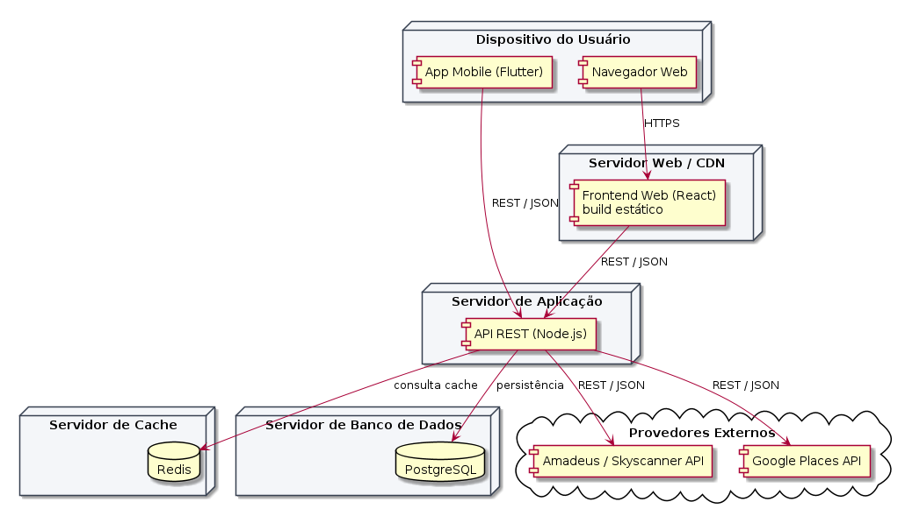
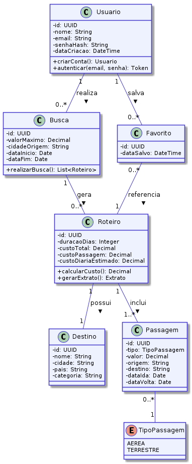
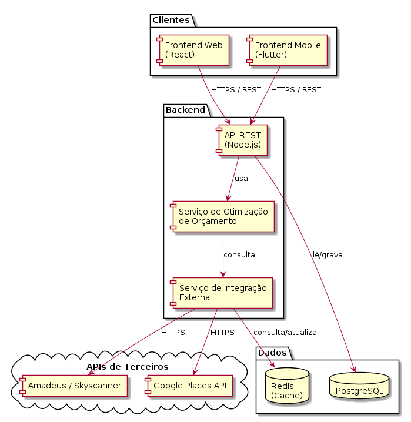

# 4. Modelagem e Projeto Arquitetural

O Limity adota uma arquitetura **Cliente-Servidor**, com um backend centralizado que concentra toda a regra de negócio e é consumido por dois clientes distintos: um frontend Web (React) e um aplicativo Mobile (Flutter). O usuário informa, em qualquer uma das duas pontas, o seu orçamento máximo, cidade de origem e disponibilidade de datas. Essa requisição é enviada via API REST ao backend, que se conecta a APIs de terceiros (companhias aéreas/agregadores de passagens e Google Places) para obter preços atualizados e caracterizar destinos por categoria. O backend então executa um algoritmo de otimização de custo, que cruza os dados de voo/hospedagem dentro do limite informado, e retorna ao cliente o roteiro mais vantajoso (destino, duração da viagem e passagem). Uma camada de cache (Redis) é utilizada para reduzir a latência dessas buscas combinatórias e evitar sobrecarga nas APIs externas. Os dados de usuários, roteiros salvos e histórico de buscas são persistidos em um banco de dados relacional (PostgreSQL).

**Figura 1 - Visão Geral da Solução do Limity (fonte: o próprio autor)**

## 4.1. Histórias de Usuário

|EU COMO... `PERSONA`| QUERO/PRECISO ... `FUNCIONALIDADE` |PARA ... `MOTIVO/VALOR`                 |
|--------------------|------------------------------------|----------------------------------------|
| Lucas (Universitário Econômico) | informar meu orçamento máximo e minha disponibilidade de datas | descobrir rapidamente para onde posso viajar sem precisar comparar preços em dezenas de sites |
| Marina (Planejadora Familiar) | inserir o valor exato que tenho guardado para a viagem | receber um pacote de viagem viável dentro desse limite, sem risco de contrair dívidas |
| Usuário do sistema | visualizar um extrato detalhado de como o orçamento será distribuído | entender quanto será gasto com passagem, hospedagem e gastos diários estimados |
| Usuário do sistema | salvar os roteiros gerados em uma lista de favoritos/histórico | consultá-los novamente no futuro sem refazer a busca |
| Usuário do sistema | criar uma conta e fazer login | manter meu histórico de buscas e roteiros salvos de forma pessoal e segura |
| Usuário do sistema | ser redirecionado ao parceiro (ex: Skyscanner, Booking) ao escolher um roteiro | concluir a compra da passagem/hospedagem com segurança fora do app |

Obs: acrescente mais linhas, se necessário.

## 4.2. Visão Lógica

### Diagrama de Classes

**Figura 2 – Diagrama de classes do Limity. Fonte: o próprio autor.**

As classes centrais identificadas para o domínio do Limity são: **Usuario** (dados de conta e autenticação), **Busca** (valor máximo, cidade de origem e período de disponibilidade informados pelo usuário), **Roteiro** (destino, duração, custo total sugerido, resultado da otimização), **Passagem** (tipo — aérea/terrestre —, valor, origem/destino), **Destino** (nome, categoria — praia, montanha, etc.), e **Favorito** (associação entre Usuario e Roteiro salvo para consulta futura).

### Diagrama de componentes

_Estilo/padrão arquitetural adotado: Cliente-Servidor, com o backend expondo uma API RESTful consumida por múltiplos clientes (Web e Mobile)._

**Figura 3 – Diagrama de Componentes do Limity. Fonte: o próprio autor.**

Os componentes identificados são:

- **Frontend Web** (React) – interface acessada via navegador; envia o orçamento do usuário para a API e renderiza os roteiros retornados. *A ser desenvolvido.*
- **Frontend Mobile** (Flutter) – aplicativo cross-platform (Android/iOS) que consome a mesma API REST do sistema Web, garantindo paridade de dados e experiência. *A ser desenvolvido.*
- **Backend / API REST** (Node.js) – componente central que recebe o orçamento, orquestra as integrações externas e executa o algoritmo de otimização de custo. *A ser desenvolvido.*
- **Serviço de Integração com APIs Externas** – responsável por consultar preços de passagens (Amadeus/Skyscanner) e caracterizar destinos (Google Places API). *A ser desenvolvido.*
- **Camada de Cache** (Redis) – armazena temporariamente rotas e preços consultados com frequência, reduzindo latência e chamadas repetidas às APIs externas. *Componente reutilizado (produto de mercado).*
- **Banco de Dados** (PostgreSQL) – armazena usuários, roteiros salvos e histórico de buscas. *Componente reutilizado (SGBD de mercado).*
- **APIs de Terceiros** (Amadeus/Skyscanner, Google Places) – provedores externos de dados de preços e destinos. *Componentes adquiridos/de terceiros.*

## 4.3. Modelo de dados (opcional)

 ")

**Figura 4 – Diagrama de Entidade Relacionamento (ER) do Limity. Fonte: o próprio autor.**

As entidades e relacionamentos principais são: um **Usuario** realiza várias **Busca** e pode salvar vários **Roteiro** como **Favorito**; cada **Busca** gera um ou mais **Roteiro** candidatos; cada **Roteiro** está associado a um **Destino** e inclui uma ou mais **Passagem** (aérea ou terrestre).
