# Avaliação Heurística

**Aplicação:** Crie seu jogo! ([https://eumsmo.github.io/puc-ic/Editor/](https://eumsmo.github.io/puc-ic/Editor/))[cite: 1]

---

## 1. Introdução

### Objetivo da análise

Analisar a usabilidade da ferramenta de criação de jogos desenvolvida pelo mestrando Daniel Duarte que pode ser acessado pelo link [https://eumsmo.github.io/puc-ic/Editor/](https://eumsmo.github.io/puc-ic/Editor/)[cite: 1]. Para criar os jogos, será usado como base o artigo _"Sistemas Tutores Inteligentes na Aprendizagem por Competências: Uma Revisão Sistemática da Literatura"_ disponível em [https://sol.sbc.org.br/index.php/sbie/article/view/26740/26559](https://sol.sbc.org.br/index.php/sbie/article/view/26740/26559)[cite: 1].

### Cenário da análise

Maria escreveu o artigo _"Sistemas Tutores Inteligentes na Aprendizagem por Competências: Uma Revisão Sistemática da Literatura"_ e como forma de querer engajar pessoas como seus amigos ao seu conteúdo decidiu usar o editor de jogos [https://eumsmo.github.io/puc-ic/Editor/](https://eumsmo.github.io/puc-ic/Editor/) para criar 2 jogos sobre o seu artigo[cite: 1]. Ela decidiu criar um jogo do tipo "Artigo", explorando o resumo do artigo explorar a capacidade das pessoas em adivinhar palavras, e um do tipo "Dados" onde ela poderia fazer diferentes tipos de perguntas envolvendo informações e dados contidos em seu artigo[cite: 1]. Ela decidiu explorar todos os recursos disponíveis para criar os jogos, criando todos os tipos de perguntas possíveis para explorar diferentes aspectos do seu artigo[cite: 1]. Após criar os jogos, ela os jogos para ver se estava conforme ela esperava e depois deste teste ela compartilhou os jogos com amigos e pessoas interessadas em sua pesquisa[cite: 1].

### Metodologia do estudo

O estudo foi feito com a participação de 4 avaliadores, onde cada um realizou a sua avaliação individualmente e depois de todos fazerem suas análises foi construído este relatório consolidado com a triangulação dos resultados, apontando as categorias dos problemas que mais aparecem e relevantes[cite: 1]. O relatório consolidado foi construído a partir de discussões entre os participantes e casos de não concordância foram resolvidos entre as partes[cite: 1].

### Heurísticas

Foram utilizadas na avaliação as seguintes heurísticas[cite: 1]:

1. Visibilidade do estado do sistema[cite: 1]
2. Correspondência entre o sistema e o mundo real[cite: 1]
3. Controle e liberdade do usuário[cite: 1]
4. Consistência e padronização[cite: 1]
5. Prevenção de erros[cite: 1]
6. Reconhecimento em vez de memorização[cite: 1]
7. Flexibilidade e eficiência de uso[cite: 1]
8. Projeto estético e minimalista[cite: 1]
9. Apoio ao reconhecimento, diagnóstico e recuperação de erros[cite: 1]
10. Ajuda e documentação[cite: 1]

---

## 2. Avaliadores

1. João[cite: 1]
2. Maria[cite: 1]
3. Pedro[cite: 1]
4. Pietra[cite: 1]

---

## 3. Principais Problemas

| #      | Problema / Título                                                            | Severidade          | Heurísticas Violadas |        Acesso Rápido         |
| ------ | ---------------------------------------------------------------------------- | ------------------- | -------------------- | :--------------------------: |
| **01** | Salvando Manualmente os jogos                                                | Grande              | 6, 10                | [Ver Detalhes](#problema-01) |
| **02** | Navegação dentro do jogo                                                     | Catastrófico        | 1, 3                 | [Ver Detalhes](#problema-02) |
| **03** | Criação e exibição de perguntas no jogo "Dados"                              | Grande              | 5, 10                | [Ver Detalhes](#problema-03) |
| **04** | Iniciar um jogo                                                              | Cosmético / Pequeno | 2, 5, 10             | [Ver Detalhes](#problema-04) |
| **05** | Leitura e interação com o jogo do tipo "Artigo"                              | Catastrófico        | 3, 7                 | [Ver Detalhes](#problema-05) |
| **06** | Inserção de palavras no jogo do artigo                                       | Catastrófico        | 7, 9                 | [Ver Detalhes](#problema-06) |
| **07** | Iniciar o jogo do tipo 'Artigo' após criação                                 | Grande              | 1, 7, 10             | [Ver Detalhes](#problema-07) |
| **08** | Visualização e preenchimento das caixas de resposta no jogo do tipo "Artigo" | Cosmético           | 2, 5                 | [Ver Detalhes](#problema-08) |
| **09** | Inserção de palavras no jogo (Palavra já descoberta)                         | Cosmético / Pequeno | 1, 2                 | [Ver Detalhes](#problema-09) |
| **10** | Criar uma pergunta do tipo 'Dados' (Explicação dos tipos)                    | Grande              | 1, 2, 5, 10          | [Ver Detalhes](#problema-10) |
| **11** | Seleção do tipo de resposta para perguntas "Valor Bruto"                     | Pequeno             | 3, 7, 8              | [Ver Detalhes](#problema-11) |
| **12** | Inconsistência na nomenclatura dos títulos de criação                        | Cosmético           | 4                    | [Ver Detalhes](#problema-12) |
| **13** | Funcionalidade de revelar palavra já descoberta                              | Grande              | 1                    | [Ver Detalhes](#problema-13) |
| **14** | Visualização dos resultados ao final do jogo "Dados"                         | Catastrófico        | 2, 10                | [Ver Detalhes](#problema-14) |
| **15** | Clareza do texto do resumo ao fim do jogo                                    | Pequeno / Cosmético | 8                    | [Ver Detalhes](#problema-15) |
| **16** | Repetição desnecessária no preenchimento de informações                      | Pequeno             | 7                    | [Ver Detalhes](#problema-16) |
| **17** | Clareza do nome do jogo "Dados"                                              | Cosmético / Pequeno | 2, 8, 10             | [Ver Detalhes](#problema-17) |
| **18** | Posicionamento do botão "Nova Pergunta"                                      | Grande              | 3, 7, 8              | [Ver Detalhes](#problema-18) |
| **19** | Clareza dos campos "Valor Mínimo" e "Valor Máximo"                           | Pequeno             | 1, 2, 10             | [Ver Detalhes](#problema-19) |
| **20** | Clareza na utilização do tipo de pergunta "Gráfico"                          | Grande              | 1, 2, 10             | [Ver Detalhes](#problema-20) |
| **21** | Inconsistência na sincronização dos valores padrão na barra seletora         | Pequeno             | 1, 4, 5              | [Ver Detalhes](#problema-21) |
| **22** | Falta de feedback ao inserir valores acima do limite no "Gráfico"            | Pequeno             | 1, 4, 5              | [Ver Detalhes](#problema-22) |
| **23** | Rótulo do botão no pop-up de resposta após acerto ("Confirmar")              | Cosmético / Pequeno | 1, 2, 10             | [Ver Detalhes](#problema-23) |
| **24** | Cor e rótulo do botão no pop-up de resposta ao errar                         | Pequeno             | 1, 2, 4, 5           | [Ver Detalhes](#problema-24) |
| **25** | Exibição de informações sobre o desempenho no final do teste                 | Catastrófico        | 1, 2, 3              | [Ver Detalhes](#problema-25) |
| **26** | Terminologia utilizada para descrever as perguntas ("problemas")             | Cosmético           | 2                    | [Ver Detalhes](#problema-26) |
| **27** | Exibição de valores ao errar pergunta do tipo "Valor Bruto"                  | Pequeno             | 1, 2, 5              | [Ver Detalhes](#problema-27) |
| **28** | Indicação do tipo "Valor Bruto" e inconsistência da barra seletora           | Grande              | 2, 4, 6              | [Ver Detalhes](#problema-28) |

---

### Problema 01

| Campo                        | Detalhes                                                                                                                                                                                                                                                                              |
| ---------------------------- | ------------------------------------------------------------------------------------------------------------------------------------------------------------------------------------------------------------------------------------------------------------------------------------- |
| **Número do Problema**       | 1                                                                                                                                                                                                                                                                                     |
| **Avaliadores**              | **1:** [ X ] &nbsp;&nbsp; **2:** [ &nbsp; ] &nbsp;&nbsp; **3:** [ X ] &nbsp;&nbsp; **4:** [ X ]                                                                                                                                                                                       |
| **Atividade**                | Salvando Manualmente os jogos                                                                                                                                                                                                                                                         |
| **Problema**                 | O processo de salvamento manual apresenta descrições muito curtas para procedimentos complexos, tornando difícil para o usuário compreender as etapas necessárias. A falta de instruções detalhadas pode levar à frustração e, possivelmente, à desistência do uso da funcionalidade. |
| **Heurística(s) violada(s)** | 6. Reconhecimento em vez de memorização 10. Ajuda e Documentação                                                                                                                                                                                                                   |
| **Severidade**               | [ ] Catastrófico &nbsp;&nbsp; [X] Grande &nbsp;&nbsp; [ ] Pequeno &nbsp;&nbsp; [ ] Cosmético                                                                                                                                                                                          |
| **Local**                    | Página de salvamento manual dos jogos                                                                                                                                                                                                                                                 |
| **Solução**                  | Incluir instruções mais detalhadas e intuitivas para cada etapa do salvamento manual, garantindo que o usuário compreenda claramente o processo antes de executá-lo. O uso de exemplos visuais ou guias passo a passo pode melhorar a experiência do usuário.                         |

#### Evidência(s)

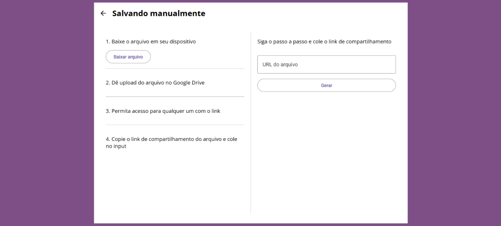

[⬆ Voltar ao Sumário](#3-principais-problemas)

---

### Problema 02

| Campo                        | Detalhes                                                                                                                                                                                                                                                                                                                                                                                    |
| ---------------------------- | ------------------------------------------------------------------------------------------------------------------------------------------------------------------------------------------------------------------------------------------------------------------------------------------------------------------------------------------------------------------------------------------- |
| **Número do Problema**       | 2                                                                                                                                                                                                                                                                                                                                                                                           |
| **Avaliadores**              | **1:** [ X ] &nbsp;&nbsp; **2:** [ X ] &nbsp;&nbsp; **3:** [ X ] &nbsp;&nbsp; **4:** [ &nbsp; ]                                                                                                                                                                                                                                                                                             |
| **Atividade**                | Navegação dentro do jogo                                                                                                                                                                                                                                                                                                                                                                    |
| **Problema**                 | O usuário não tem uma indicação clara de como sair da tela ou retornar à tela inicial. A navegação é limitada, pois o botão "voltar" do próprio navegador não funciona, obrigando o usuário a depender unicamente da seta de voltar interna do jogo (quando disponível). Isso pode causar frustração e confusão, especialmente se o usuário estiver preso em uma determinada etapa do jogo. |
| **Heurística(s) violada(s)** | 1. Visibilidade do estado do sistema 3. Controle e liberdade do usuário                                                                                                                                                                                                                                                                                                                  |
| **Severidade**               | [X] Catastrófico &nbsp;&nbsp; [ ] Grande &nbsp;&nbsp; [ ] Pequeno &nbsp;&nbsp; [ ] Cosmético                                                                                                                                                                                                                                                                                                |
| **Local**                    | Todas as páginas do jogo (atividade "Dado e Artigo")                                                                                                                                                                                                                                                                                                                                        |
| **Solução**                  | Permitir que o botão "voltar" do navegador funcione corretamente, garantindo que o usuário possa retornar às telas anteriores de maneira intuitiva. Além disso, adicionar um botão visível para retornar à tela inicial dentro da interface do jogo, aumentando a liberdade de navegação e reduzindo a dependência de controles internos específicos.                                       |

#### Evidência(s)

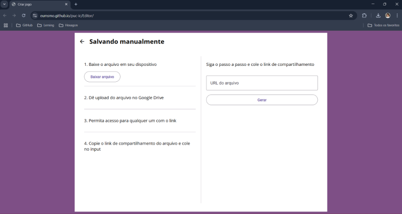

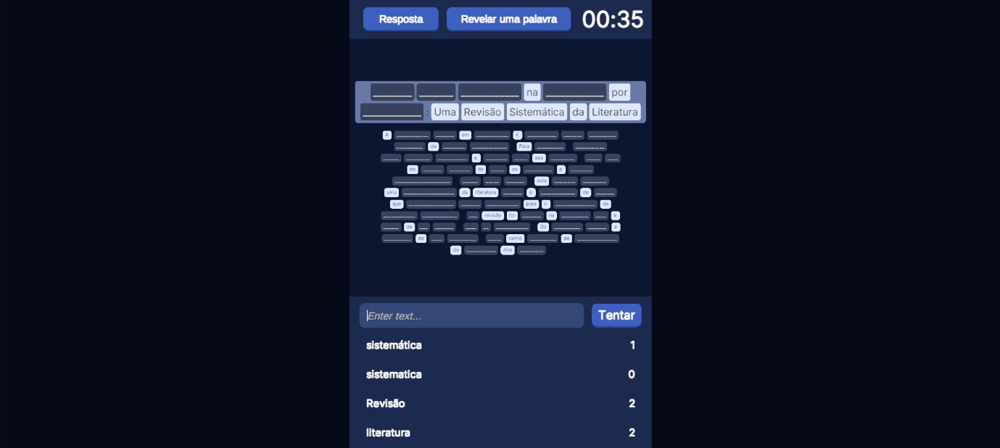

[⬆ Voltar ao Sumário](#3-principais-problemas)

---

### Problema 03

| Campo                        | Detalhes                                                                                                                                                                                                                                                                                                                                                                                                                                                                                                              |
| ---------------------------- | --------------------------------------------------------------------------------------------------------------------------------------------------------------------------------------------------------------------------------------------------------------------------------------------------------------------------------------------------------------------------------------------------------------------------------------------------------------------------------------------------------------------- |
| **Número do Problema**       | 3                                                                                                                                                                                                                                                                                                                                                                                                                                                                                                                     |
| **Avaliadores**              | **1:** [ X ] &nbsp;&nbsp; **2:** [ X ] &nbsp;&nbsp; **3:** [ X ] &nbsp;&nbsp; **4:** [ &nbsp; ]                                                                                                                                                                                                                                                                                                                                                                                                                       |
| **Atividade**                | Criação e exibição de perguntas no jogo "Dados"                                                                                                                                                                                                                                                                                                                                                                                                                                                                       |
| **Problema**                 | O sistema permite que o jogo "Dados" seja salvo mesmo quando há perguntas vazias. Além disso, essas perguntas vazias são exibidas no aplicativo, o que pode gerar confusão para os usuários. Essa falha compromete a experiência do jogador, pois perguntas incompletas ou inexistentes dificultam a compreensão do que deve ser respondido, além de resultar em comportamentos inesperados na execução do jogo e em uma interface inconsistente.                                                                     |
| **Heurística(s) violada(s)** | 5. Prevenção de erros 10. Ajuda e documentação                                                                                                                                                                                                                                                                                                                                                                                                                                                                     |
| **Severidade**               | [ ] Catastrófico &nbsp;&nbsp; [X] Grande &nbsp;&nbsp; [ ] Pequeno &nbsp;&nbsp; [ ] Cosmético                                                                                                                                                                                                                                                                                                                                                                                                                          |
| **Local**                    | Tela de criação de perguntas no jogo "Dados" Tela de exibição de perguntas no aplicativo do jogo                                                                                                                                                                                                                                                                                                                                                                                                                   |
| **Solução**                  | Implementar uma validação no momento do salvamento do jogo para garantir que todas as perguntas estejam devidamente preenchidas. Caso existam perguntas vazias, o sistema deve exibir uma mensagem de erro informando que é necessário completar todas as perguntas antes de salvar.  Garantir que perguntas vazias não sejam exibidas no aplicativo. Caso sejam detectadas, ocultá-las automaticamente ou apresentar uma mensagem de erro clara ao usuário, sinalizando a presença de uma pergunta incompleta. |

#### Evidência(s)

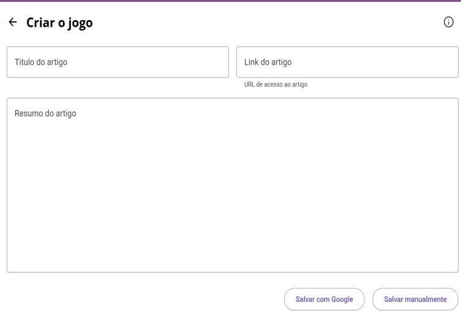

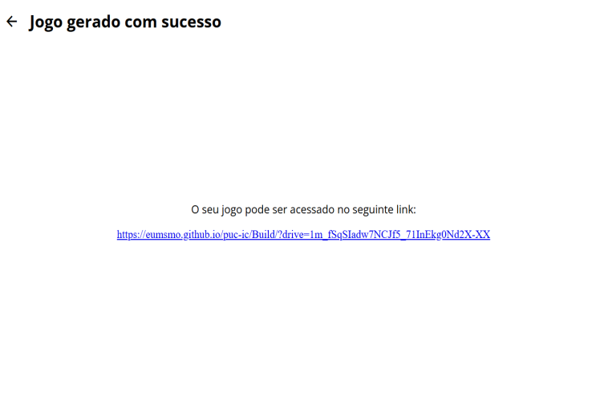

[⬆ Voltar ao Sumário](#3-principais-problemas)

---

### Problema 04

| Campo                        | Detalhes                                                                                                                                              |
| ---------------------------- | ----------------------------------------------------------------------------------------------------------------------------------------------------- |
| **Número do Problema**       | 4                                                                                                                                                     |
| **Avaliadores**              | **1:** [ X ] &nbsp;&nbsp; **2:** [ X ] &nbsp;&nbsp; **3:** [ X ] &nbsp;&nbsp; **4:** [ &nbsp; ]                                                       |
| **Atividade**                | Iniciar um jogo                                                                                                                                       |
| **Problema**                 | Não é claro que ao clicar em cada quadro é a forma de iniciar um jogo, não contendo informações explicativas do jogo                                  |
| **Heurística(s) violada(s)** | 2. Correspondência entre o sistema e o mundo real 5. Prevenção de erros 10. Ajuda e documentação                                                |
| **Severidade**               | [ ] Catastrófico &nbsp;&nbsp; [ ] Grande &nbsp;&nbsp; [X] Pequeno &nbsp;&nbsp; [X] Cosmético                                                          |
| **Local**                    | Página de criação de jogo                                                                                                                             |
| **Solução**                  | Adicionar um label indicando que ao clicar no quadro o usuário poderá criar um novo jogo e adicionar mais informações sobre o funcionamento dos jogos |

#### Evidência(s)

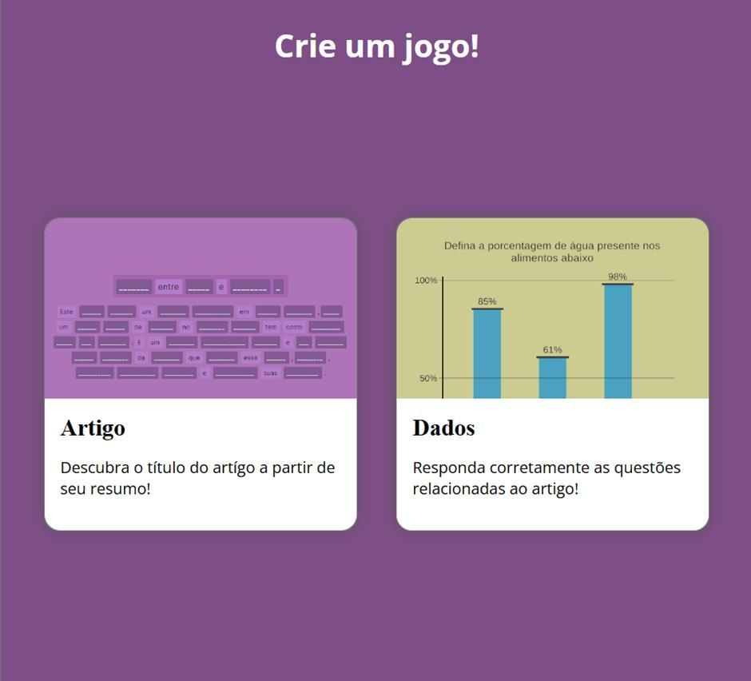

[⬆ Voltar ao Sumário](#3-principais-problemas)

---

### Problema 05

| Campo                        | Detalhes                                                                                                                                                                                                                                                                                                    |
| ---------------------------- | ----------------------------------------------------------------------------------------------------------------------------------------------------------------------------------------------------------------------------------------------------------------------------------------------------------- |
| **Número do Problema**       | 5                                                                                                                                                                                                                                                                                                           |
| **Avaliadores**              | **1:** [ X ] &nbsp;&nbsp; **2:** [ &nbsp; ] &nbsp;&nbsp; **3:** [ &nbsp; ] &nbsp;&nbsp; **4:** [ &nbsp; ]                                                                                                                                                                                                   |
| **Atividade**                | Leitura e interação com o jogo do tipo "Artigo"                                                                                                                                                                                                                                                             |
| **Problema**                 | A interface da tela do jogo não permite rolagem (ausência de um componente de ScrollView), o que dificulta a leitura completa do resumo do artigo quando o texto é mais extenso. Isso prejudica a compreensão do conteúdo por parte do usuário, afetando diretamente a jogabilidade e a experiência de uso. |
| **Heurística(s) violada(s)** | 3. Controle e liberdade do usuário 7. Flexibilidade e eficiência de uso                                                                                                                                                                                                                                  |
| **Severidade**               | [X] Catastrófico &nbsp;&nbsp; [ ] Grande &nbsp;&nbsp; [ ] Pequeno &nbsp;&nbsp; [ ] Cosmético                                                                                                                                                                                                                |
| **Local**                    | Página do jogo do tipo "Artigo"                                                                                                                                                                                                                                                                             |
| **Solução**                  | Implementar um componente de ScrollView (ou rolagem vertical) na página do jogo para permitir que o usuário leia todo o conteúdo do artigo, independentemente do tamanho do texto. Isso garante uma navegação fluida e melhora significativamente a acessibilidade à informação.                            |

#### Evidência(s)

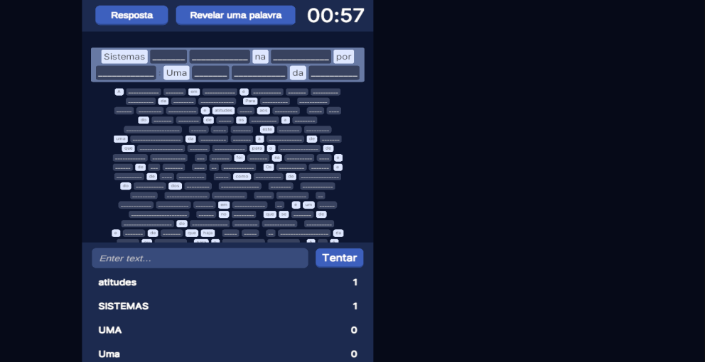

[⬆ Voltar ao Sumário](#3-principais-problemas)

---

### Problema 06

| Campo                        | Detalhes                                                                                                                                                                                                                                                                                                                                                                                                                                                                                                                                                                                                                                                                                                                                                                                                                                                                                                                                                                                                                                                                             |
| ---------------------------- | ------------------------------------------------------------------------------------------------------------------------------------------------------------------------------------------------------------------------------------------------------------------------------------------------------------------------------------------------------------------------------------------------------------------------------------------------------------------------------------------------------------------------------------------------------------------------------------------------------------------------------------------------------------------------------------------------------------------------------------------------------------------------------------------------------------------------------------------------------------------------------------------------------------------------------------------------------------------------------------------------------------------------------------------------------------------------------------ |
| **Número do Problema**       | 6                                                                                                                                                                                                                                                                                                                                                                                                                                                                                                                                                                                                                                                                                                                                                                                                                                                                                                                                                                                                                                                                                    |
| **Avaliadores**              | **1:** [ X ] &nbsp;&nbsp; **2:** [ X ] &nbsp;&nbsp; **3:** [ X ] &nbsp;&nbsp; **4:** [ &nbsp; ]                                                                                                                                                                                                                                                                                                                                                                                                                                                                                                                                                                                                                                                                                                                                                                                                                                                                                                                                                                                      |
| **Atividade**                | Inserção de palavras no jogo do artigo                                                                                                                                                                                                                                                                                                                                                                                                                                                                                                                                                                                                                                                                                                                                                                                                                                                                                                                                                                                                                                               |
| **Problema**                 | O sistema de validação de palavras apresenta baixa tolerância a variações comuns na escrita, o que compromete a usabilidade da funcionalidade. Especificamente: • Erros gramaticais simples, como ausência de acentuação ou pequenas variações de grafia, não são aceitos, mesmo quando o sentido da palavra permanece correto. Isso torna a experiência mais rígida e propensa à frustração. • O sistema realiza a validação de forma case sensitive, ou seja, diferencia letras maiúsculas e minúsculas. Com isso, palavras corretas podem ser rejeitadas se a capitalização não corresponder exatamente à esperada. • A pontuação no texto de referência (resumo/título) não é exibida corretamente, o que prejudica a leitura, a interpretação do conteúdo e a associação correta das palavras pelo jogador. • Palavras com uso irregular de maiúsculas, como "exeMPLO", não são reconhecidas como correspondentes válidas, apesar de manterem a mesma estrutura e significado. • Palavras com menos de 3 letras não são aceitas e não tem nenhum tipo de retorno |
| **Heurística(s) violada(s)** | 7. Flexibilidade e eficiência de uso 9. Apoio ao reconhecimento, diagnóstico e recuperação de erros                                                                                                                                                                                                                                                                                                                                                                                                                                                                                                                                                                                                                                                                                                                                                                                                                                                                                                                                                                               |
| **Severidade**               | [X] Catastrófico &nbsp;&nbsp; [ ] Grande &nbsp;&nbsp; [ ] Pequeno &nbsp;&nbsp; [ ] Cosmético                                                                                                                                                                                                                                                                                                                                                                                                                                                                                                                                                                                                                                                                                                                                                                                                                                                                                                                                                                                         |
| **Local**                    | Mecanismo de validação de palavras no jogo                                                                                                                                                                                                                                                                                                                                                                                                                                                                                                                                                                                                                                                                                                                                                                                                                                                                                                                                                                                                                                           |
| **Solução**                  | • Tornar a validação mais tolerante a erros comuns, como falta de acento, uso de letras maiúsculas/minúsculas fora do padrão, e variações tipográficas, por meio de algoritmos de similaridade textual. • Implementar validação case insensitive, convertendo todas as entradas para minúsculas antes da verificação. • Normalizar a entrada do usuário, removendo inconsistências visuais e de capitalização. • Corrigir a exibição da pontuação no texto do resumo/título, garantindo fidelidade ao texto original e facilitando a leitura. • Fornecer feedback claro quando uma palavra não for reconhecida, informando o motivo e, se possível, sugestões de correção.                                                                                                                                                                                                                                                                                                                                                                                               |

#### Evidência(s)

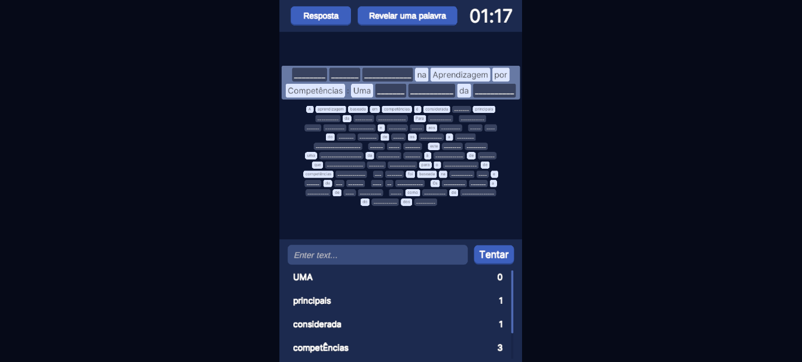

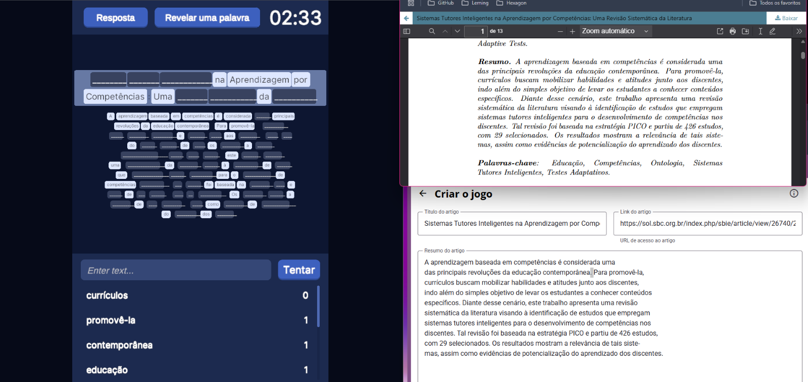

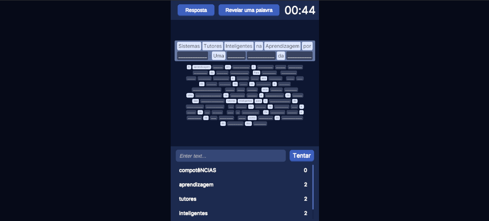

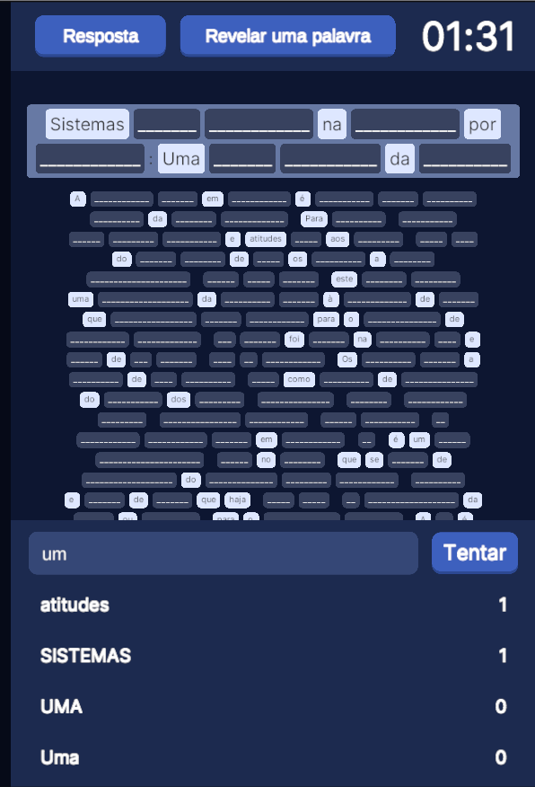

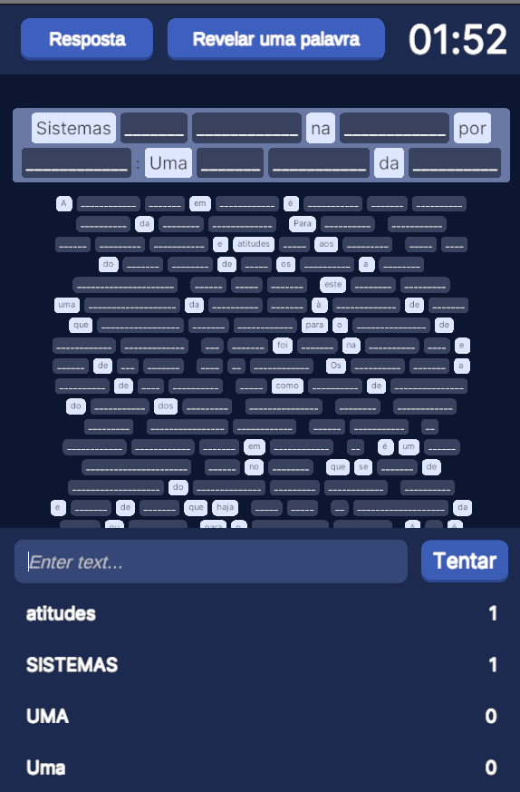

[⬆ Voltar ao Sumário](#3-principais-problemas)

---

### Problema 07

| Campo                        | Detalhes                                                                                                                                                                                                                                                                                                                                                                                                                                                                                                                                                                                                                                                                                                                                                                                                                                                                                                                                                                          |
| ---------------------------- | --------------------------------------------------------------------------------------------------------------------------------------------------------------------------------------------------------------------------------------------------------------------------------------------------------------------------------------------------------------------------------------------------------------------------------------------------------------------------------------------------------------------------------------------------------------------------------------------------------------------------------------------------------------------------------------------------------------------------------------------------------------------------------------------------------------------------------------------------------------------------------------------------------------------------------------------------------------------------------- |
| **Número do Problema**       | 7                                                                                                                                                                                                                                                                                                                                                                                                                                                                                                                                                                                                                                                                                                                                                                                                                                                                                                                                                                                 |
| **Avaliadores**              | **1:** [ X ] &nbsp;&nbsp; **2:** [ X ] &nbsp;&nbsp; **3:** [ &nbsp; ] &nbsp;&nbsp; **4:** [ &nbsp; ]                                                                                                                                                                                                                                                                                                                                                                                                                                                                                                                                                                                                                                                                                                                                                                                                                                                                              |
| **Atividade**                | Iniciar o jogo do tipo 'Artigo' após criação                                                                                                                                                                                                                                                                                                                                                                                                                                                                                                                                                                                                                                                                                                                                                                                                                                                                                                                                      |
| **Problema**                 | As instruções e elementos da interface apresentam pouca clareza quanto ao funcionamento e aos objetivos do jogo, o que pode causar confusão e comprometer a experiência do usuário. Em detalhes: • Não está claro qual é o objetivo principal do jogo: completar apenas o título, apenas o resumo ou ambos? A relação entre esses dois elementos não é explicada adequadamente. • O botão "Revelar uma palavra" é ambíguo, pois não especifica se a palavra revelada pertence ao título ou ao resumo do artigo. • O botão "Resposta" não deixa evidente qual resposta será apresentada - do título, do resumo ou de ambos. Isso pode induzir o usuário a interpretar erroneamente sua função. • Ao clicar no botão "Resposta", é exibido um pop-up com as opções "Ver artigo" e "Cancelar", sem apresentar uma resposta direta relacionada à mecânica do jogo. Isso contraria a expectativa gerada pelo nome do botão, que sugere a exibição imediata de uma solução. |
| **Heurística(s) violada(s)** | 1. Visibilidade do estado do sistema 7. Flexibilidade e eficiência de uso 10. Ajuda e documentação                                                                                                                                                                                                                                                                                                                                                                                                                                                                                                                                                                                                                                                                                                                                                                                                                                                                          |
| **Severidade**               | [ ] Catastrófico &nbsp;&nbsp; [X] Grande &nbsp;&nbsp; [ ] Pequeno &nbsp;&nbsp; [ ] Cosmético                                                                                                                                                                                                                                                                                                                                                                                                                                                                                                                                                                                                                                                                                                                                                                                                                                                                                      |
| **Local**                    | Tela do jogo do tipo 'Artigo', após clicar em 'Jogar'                                                                                                                                                                                                                                                                                                                                                                                                                                                                                                                                                                                                                                                                                                                                                                                                                                                                                                                             |
| **Solução**                  | • Revisar e expandir as instruções iniciais, explicando de forma clara e objetiva o objetivo do jogo e a relação entre o título e o resumo do artigo. • Incluir um tutorial interativo ou exemplo prático na primeira utilização, para guiar o usuário sobre o funcionamento do jogo. • Especificar claramente a função dos botões, renomeando-os para algo mais descritivo, como: "Revelar uma palavra do título", "Revelar uma palavra do resumo", "Ver resposta do título", "Ver resposta do resumo". • Reformular o botão "Resposta" e o pop-up correspondente, para que reflitam corretamente sua função. Por exemplo: Alterar o rótulo para "Consultar artigo para resposta", Adicionar uma breve explicação no pop-up: "As respostas podem ser encontradas no artigo completo. Clique em 'Ver artigo' para acessá-lo."                                                                                                                                            |

#### Evidência(s)

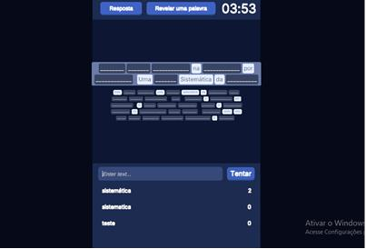

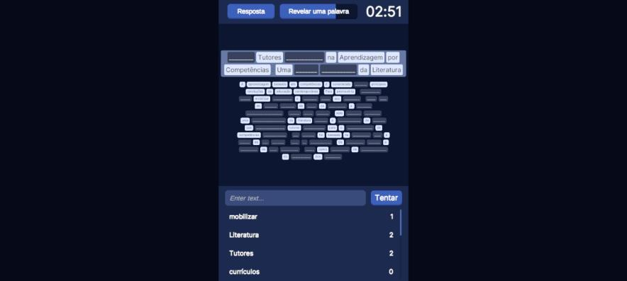

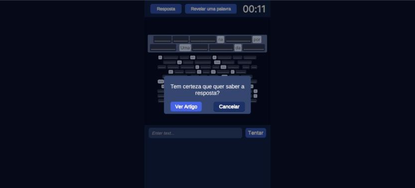

[⬆ Voltar ao Sumário](#3-principais-problemas)

---

### Problema 08

| Campo                        | Detalhes                                                                                                                                                                                                                                                                                                                                                                                              |
| ---------------------------- | ----------------------------------------------------------------------------------------------------------------------------------------------------------------------------------------------------------------------------------------------------------------------------------------------------------------------------------------------------------------------------------------------------- |
| **Número do Problema**       | 8                                                                                                                                                                                                                                                                                                                                                                                                     |
| **Avaliadores**              | **1:** [ X ] &nbsp;&nbsp; **2:** [ &nbsp; ] &nbsp;&nbsp; **3:** [ &nbsp; ] &nbsp;&nbsp; **4:** [ &nbsp; ]                                                                                                                                                                                                                                                                                             |
| **Atividade**                | Visualização e preenchimento das caixas de resposta no jogo do tipo "Artigo"                                                                                                                                                                                                                                                                                                                          |
| **Problema**                 | Os campos destinados à inserção de letras nas caixas de resposta apresentam baixa visibilidade e pouca separação visual, o que dificulta a identificação dos limites entre as letras e entre as palavras. Essa falta de clareza pode gerar confusão durante a digitação e comprometer a precisão das respostas, especialmente em dispositivos com telas menores ou em ambientes com pouca iluminação. |
| **Heurística(s) violada(s)** | 2. Correspondência entre o sistema e o mundo real 5. Prevenção de erros                                                                                                                                                                                                                                                                                                                            |
| **Severidade**               | [ ] Catastrófico &nbsp;&nbsp; [ ] Grande &nbsp;&nbsp; [ ] Pequeno &nbsp;&nbsp; [X] Cosmético                                                                                                                                                                                                                                                                                                          |
| **Local**                    | Tela do jogo do tipo "Artigo" - campos de preenchimento de respostas                                                                                                                                                                                                                                                                                                                                  |
| **Solução**                  | Aumentar o contraste visual entre os espaços destinados a cada letra e aplicar divisores ou espaçamentos mais nítidos entre as palavras. Isso pode ser feito com linhas de contorno mais visíveis, uso de cores de fundo alternadas ou margens claras entre os campos, facilitando a distinção visual e prevenindo erros durante a inserção de respostas.                                             |

#### Evidência(s)

[⬆ Voltar ao Sumário](#3-principais-problemas)

---

### Problema 09

| Campo                        | Detalhes                                                                                                                                                                                        |
| ---------------------------- | ----------------------------------------------------------------------------------------------------------------------------------------------------------------------------------------------- |
| **Número do Problema**       | 9                                                                                                                                                                                               |
| **Avaliadores**              | **1:** [ X ] &nbsp;&nbsp; **2:** [ &nbsp; ] &nbsp;&nbsp; **3:** [ &nbsp; ] &nbsp;&nbsp; **4:** [ &nbsp; ]                                                                                       |
| **Atividade**                | Inserção de palavras no jogo                                                                                                                                                                    |
| **Problema**                 | Quando o usuário insere uma palavra que já foi descoberta anteriormente, o sistema não fornece nenhum feedback, o que pode gerar confusão sobre se a entrada foi registrada corretamente ou não |
| **Heurística(s) violada(s)** | 1. Visibilidade do estado do sistema 2. Correspondência entre o sistema e o mundo real                                                                                                       |
| **Severidade**               | [ ] Catastrófico &nbsp;&nbsp; [ ] Grande &nbsp;&nbsp; [X] Pequeno &nbsp;&nbsp; [X] Cosmético                                                                                                    |
| **Local**                    | Tela de jogo inserção de palavras                                                                                                                                                               |
| **Solução**                  | Exibir uma mensagem visual indicando que a palavra já foi descoberta, evitando que o usuário tente inseri-la novamente sem necessidade                                                          |

#### Evidência(s)

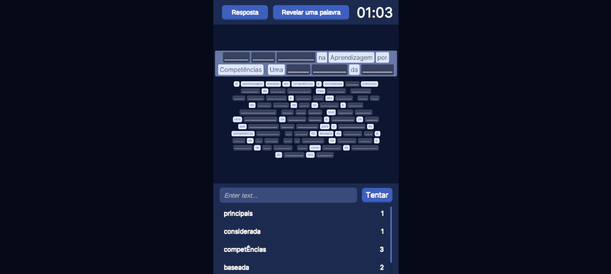

[⬆ Voltar ao Sumário](#3-principais-problemas)

---

### Problema 10

| Campo                        | Detalhes                                                                                                                                       |
| ---------------------------- | ---------------------------------------------------------------------------------------------------------------------------------------------- |
| **Número do Problema**       | 10                                                                                                                                             |
| **Avaliadores**              | **1:** [ X ] &nbsp;&nbsp; **2:** [ X ] &nbsp;&nbsp; **3:** [ &nbsp; ] &nbsp;&nbsp; **4:** [ &nbsp; ]                                           |
| **Atividade**                | Criar uma pergunta do tipo 'Dados'.                                                                                                            |
| **Problema**                 | O sistema não fornece explicações sobre os tipos de pergunta (afirmativa, valor bruto, gráfico), gerando dúvidas no momento da escolha.        |
| **Heurística(s) violada(s)** | 1. Visibilidade do estado do sistema 2. Correspondência entre o sistema e o mundo real 5. Prevenção de erros 10. Ajuda e documentação |
| **Severidade**               | [ ] Catastrófico &nbsp;&nbsp; [X] Grande &nbsp;&nbsp; [ ] Pequeno &nbsp;&nbsp; [ ] Cosmético                                                   |
| **Local**                    | Tela de criação de pergunta (modo Dados).                                                                                                      |
| **Solução**                  | Adicionar descrições curtas ou exemplos explicativos ao lado de cada tipo de pergunta.                                                         |

#### Evidência(s)

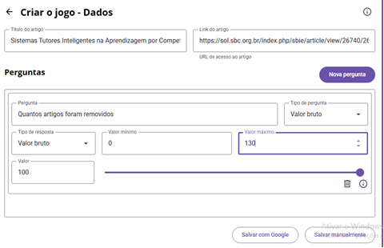

[⬆ Voltar ao Sumário](#3-principais-problemas)

---

### Problema 11

| Campo                        | Detalhes                                                                                                                                                                                                                                                       |
| ---------------------------- | -------------------------------------------------------------------------------------------------------------------------------------------------------------------------------------------------------------------------------------------------------------- |
| **Número do Problema**       | 11                                                                                                                                                                                                                                                             |
| **Avaliadores**              | **1:** [ X ] &nbsp;&nbsp; **2:** [ X ] &nbsp;&nbsp; **3:** [ &nbsp; ] &nbsp;&nbsp; **4:** [ &nbsp; ]                                                                                                                                                           |
| **Atividade**                | Avaliação da seleção do tipo de resposta para perguntas do tipo "Valor Bruto" no jogo do tipo "Dados"                                                                                                                                                          |
| **Problema**                 | Quando se cria uma pergunta do tipo "Valor Bruto", o usuário também precisa selecionar o tipo de resposta, podendo escolher entre "Valor Bruto" ou "Porcentagem". Isso pode causar confusão, pois a relação entre a pergunta e a resposta pode não estar clara |
| **Heurística(s) violada(s)** | 3. Controle e liberdade do usuário 7. Flexibilidade e eficiência de uso 8. Projeto estético e minimalista                                                                                                                                                |
| **Severidade**               | [ ] Catastrófico &nbsp;&nbsp; [ ] Grande &nbsp;&nbsp; [X] Pequeno &nbsp;&nbsp; [ ] Cosmético                                                                                                                                                                   |
| **Local**                    | Tela de criação de perguntas no jogo "Dados"                                                                                                                                                                                                                   |
| **Solução**                  | Melhorar a interface para deixar claro porque a escolha do tipo de resposta é necessária. Incluir uma explicação ou pré-selecionar a opção mais lógica com base no tipo de pergunta.                                                                           |

#### Evidência(s)

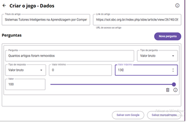

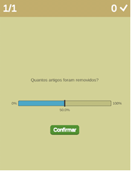

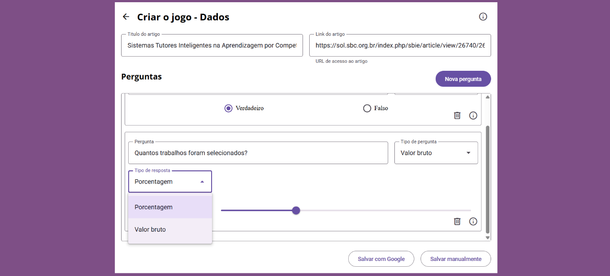

[⬆ Voltar ao Sumário](#3-principais-problemas)

---

### Problema 12

| Campo                        | Detalhes                                                                                                                                                                                                                                                                                                                                                        |
| ---------------------------- | --------------------------------------------------------------------------------------------------------------------------------------------------------------------------------------------------------------------------------------------------------------------------------------------------------------------------------------------------------------- |
| **Número do Problema**       | 12                                                                                                                                                                                                                                                                                                                                                              |
| **Avaliadores**              | **1:** [ X ] &nbsp;&nbsp; **2:** [ &nbsp; ] &nbsp;&nbsp; **3:** [ &nbsp; ] &nbsp;&nbsp; **4:** [ &nbsp; ]                                                                                                                                                                                                                                                       |
| **Atividade**                | Criação de jogos do tipo "Artigo" e "Dados"                                                                                                                                                                                                                                                                                                                     |
| **Problema**                 | Há inconsistência na nomenclatura dos títulos nas páginas de criação de jogos. Na tela do jogo do tipo "Artigo", o título exibido é "Criar o jogo", enquanto na tela do jogo do tipo "Dados" aparece como "Criar o jogo - Dados". Essa falta de padronização pode gerar confusão no usuário quanto à estrutura do sistema e quebra a uniformidade da interface. |
| **Heurística(s) violada(s)** | 4. Consistência e padronização                                                                                                                                                                                                                                                                                                                                  |
| **Severidade**               | [ ] Catastrófico &nbsp;&nbsp; [ ] Grande &nbsp;&nbsp; [ ] Pequeno &nbsp;&nbsp; [X] Cosmético                                                                                                                                                                                                                                                                    |
| **Local**                    | Páginas de criação dos jogos "Artigo" e "Dados"                                                                                                                                                                                                                                                                                                                 |
| **Solução**                  | Padronizar os títulos das páginas de criação de jogo, adotando um formato consistente para todos os tipos de jogo. Uma sugestão é utilizar o padrão "Criar jogo - [Nome do Tipo]", garantindo clareza e uniformidade em toda a aplicação.                                                                                                                       |

#### Evidência(s)

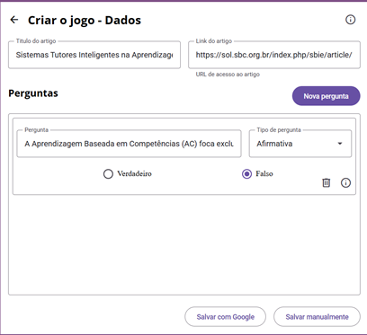

[⬆ Voltar ao Sumário](#3-principais-problemas)

---

### Problema 13

| Campo                        | Detalhes                                                                                                                                                                                                                                                                                |
| ---------------------------- | --------------------------------------------------------------------------------------------------------------------------------------------------------------------------------------------------------------------------------------------------------------------------------------- |
| **Número do Problema**       | 13                                                                                                                                                                                                                                                                                      |
| **Avaliadores**              | **1:** [ X ] &nbsp;&nbsp; **2:** [ &nbsp; ] &nbsp;&nbsp; **3:** [ &nbsp; ] &nbsp;&nbsp; **4:** [ &nbsp; ]                                                                                                                                                                               |
| **Atividade**                | Utilizar a funcionalidade de revelar uma palavra no jogo do tipo "Artigo"                                                                                                                                                                                                               |
| **Problema**                 | Ao acionar a opção de revelar uma palavra, o sistema pode exibir uma palavra que o usuário já descobriu anteriormente. Isso compromete a utilidade da funcionalidade, desperdiçando uma dica que deveria ser útil para o avanço no jogo e causando frustração no jogador.               |
| **Heurística(s) violada(s)** | 1. Visibilidade do estado do sistema                                                                                                                                                                                                                                                    |
| **Severidade**               | [ ] Catastrófico &nbsp;&nbsp; [X] Grande &nbsp;&nbsp; [ ] Pequeno &nbsp;&nbsp; [ ] Cosmético                                                                                                                                                                                            |
| **Local**                    | Página do jogo do tipo "Artigo"                                                                                                                                                                                                                                                         |
| **Solução**                  | Implementar uma verificação no sistema para garantir que apenas palavras ainda não descobertas sejam elegíveis para revelação. Dessa forma, a funcionalidade se mantém útil e alinhada com as expectativas do usuário, contribuindo para uma experiência mais satisfatória e eficiente. |

#### Evidência(s)

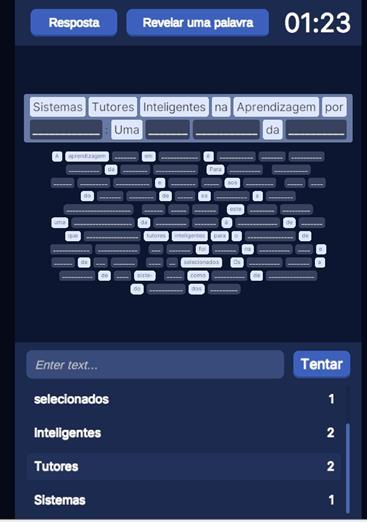

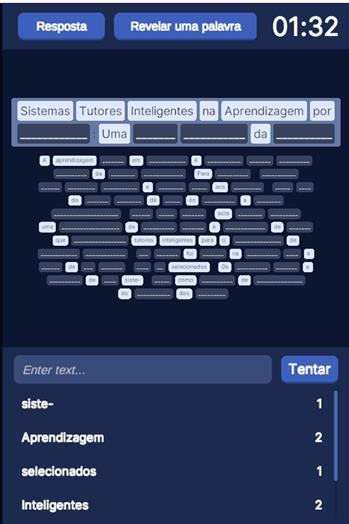

[⬆ Voltar ao Sumário](#3-principais-problemas)

---

### Problema 14

| Campo                        | Detalhes                                                                                                                                                                                                                                                                                                                                                                                                                                                                                                                                                                                                                                                                                                                                                                                                             |
| ---------------------------- | -------------------------------------------------------------------------------------------------------------------------------------------------------------------------------------------------------------------------------------------------------------------------------------------------------------------------------------------------------------------------------------------------------------------------------------------------------------------------------------------------------------------------------------------------------------------------------------------------------------------------------------------------------------------------------------------------------------------------------------------------------------------------------------------------------------------- |
| **Número do Problema**       | 14                                                                                                                                                                                                                                                                                                                                                                                                                                                                                                                                                                                                                                                                                                                                                                                                                   |
| **Avaliadores**              | **1:** [ X ] &nbsp;&nbsp; **2:** [ X ] &nbsp;&nbsp; **3:** [ &nbsp; ] &nbsp;&nbsp; **4:** [ &nbsp; ]                                                                                                                                                                                                                                                                                                                                                                                                                                                                                                                                                                                                                                                                                                                 |
| **Atividade**                | Visualização dos resultados ao final do jogo do tipo "Dados"                                                                                                                                                                                                                                                                                                                                                                                                                                                                                                                                                                                                                                                                                                                                                         |
| **Problema**                 | O sistema apresenta falhas na exibição de informações de desempenho ao final do teste no jogo "Dados". Em primeiro lugar, o usuário recebe uma mensagem de "Parabéns" mesmo quando não obteve um bom desempenho ou sequer acertou a maioria das questões, o que contradiz a lógica esperada e pode causar confusão ou sensação de ironia.  Além disso, os resultados exibem apenas a porcentagem de acertos, sem informar o número total de perguntas, a quantidade de acertos ou erros. Essa apresentação incompleta prejudica a compreensão real do desempenho, especialmente em jogos curtos, onde a porcentagem isolada pode ser pouco significativa ou até enganosa.                                                                                                                                      |
| **Heurística(s) violada(s)** | 2. Correspondência entre o sistema e o mundo real 10. Ajuda e documentação                                                                                                                                                                                                                                                                                                                                                                                                                                                                                                                                                                                                                                                                                                                                        |
| **Severidade**               | [X] Catastrófico &nbsp;&nbsp; [ ] Grande &nbsp;&nbsp; [ ] Pequeno &nbsp;&nbsp; [ ] Cosmético                                                                                                                                                                                                                                                                                                                                                                                                                                                                                                                                                                                                                                                                                                                         |
| **Local**                    | Tela de resultados do jogo do tipo "Dados"                                                                                                                                                                                                                                                                                                                                                                                                                                                                                                                                                                                                                                                                                                                                                                           |
| **Solução**                  | 1) Revisar a mensagem de feedback final, garantindo que ela reflita adequadamente o desempenho do usuário. A mensagem de "Parabéns" deve ser exibida apenas em casos de bom desempenho ou ser substituída por textos neutros ou encorajadores quando os resultados forem baixos. 2) Exibir informações adicionais junto à porcentagem de acertos, incluindo: Número total de questões respondidas, Quantidade de acertos, Quantidade de erros. 3) Adicionar feedbacks visuais e textuais (como emojis, medalhas ou frases motivacionais) que reforcem ou suavizem o resultado, tornando a interpretação mais clara, amigável e motivadora. 4) Padronizar a apresentação das informações, utilizando uma estrutura visual limpa e organizada para facilitar a leitura rápida e a compreensão dos resultados. |

#### Evidência(s)

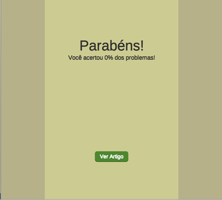

[⬆ Voltar ao Sumário](#3-principais-problemas)

---

### Problema 15

| Campo                        | Detalhes                                                                                                                                                                                             |
| ---------------------------- | ---------------------------------------------------------------------------------------------------------------------------------------------------------------------------------------------------- |
| **Número do Problema**       | 15                                                                                                                                                                                                   |
| **Avaliadores**              | **1:** [ X ] &nbsp;&nbsp; **2:** [ &nbsp; ] &nbsp;&nbsp; **3:** [ &nbsp; ] &nbsp;&nbsp; **4:** [ &nbsp; ]                                                                                            |
| **Atividade**                | Avaliação da clareza do texto do resumo ao fim do jogo.                                                                                                                                              |
| **Problema**                 | O texto do resumo é exibido de forma confusa ao fim do jogo, dificultando a leitura e compreensão pelo usuário. O layout desorganizado e a falta de separação visual tornam o texto menos acessível. |
| **Heurística(s) violada(s)** | 8. Projeto estético e minimalista                                                                                                                                                                    |
| **Severidade**               | [ ] Catastrófico &nbsp;&nbsp; [ ] Grande &nbsp;&nbsp; [X] Pequeno &nbsp;&nbsp; [X] Cosmético                                                                                                         |
| **Local**                    | Tela de fim de jogo                                                                                                                                                                                  |
| **Solução**                  | Reestruturar a apresentação do resumo, organizando o texto com espaçamento adequado, separação clara entre seções e possível uso de negrito ou listas para destacar informações importantes.         |

#### Evidência(s)

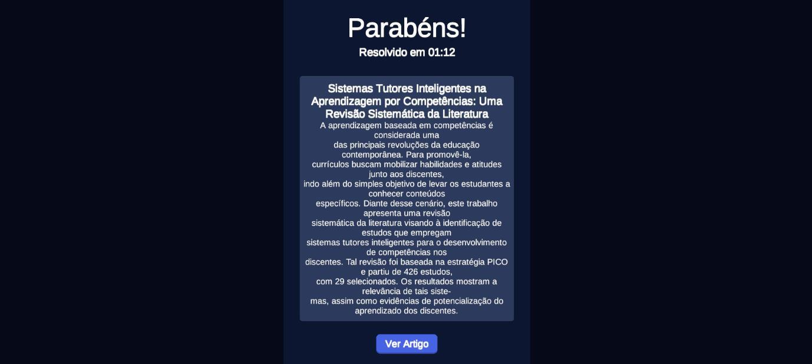

[⬆ Voltar ao Sumário](#3-principais-problemas)

---

### Problema 16

| Campo                        | Detalhes                                                                                                                                                                                         |
| ---------------------------- | ------------------------------------------------------------------------------------------------------------------------------------------------------------------------------------------------ |
| **Número do Problema**       | 16                                                                                                                                                                                               |
| **Avaliadores**              | **1:** [ &nbsp; ] &nbsp;&nbsp; **2:** [ X ] &nbsp;&nbsp; **3:** [ &nbsp; ] &nbsp;&nbsp; **4:** [ &nbsp; ]                                                                                        |
| **Atividade**                | Avaliação da repetição desnecessária no preenchimento de informações ao criar jogos.                                                                                                             |
| **Problema**                 | O usuário precisa preencher manualmente o título do artigo e o link duas vezes ao criar os dois tipos de jogos disponíveis (artigo e dados). Isso torna o processo redundante e menos eficiente. |
| **Heurística(s) violada(s)** | 7. Flexibilidade e eficiência de uso                                                                                                                                                             |
| **Severidade**               | [ ] Catastrófico &nbsp;&nbsp; [ ] Grande &nbsp;&nbsp; [X] Pequeno &nbsp;&nbsp; [ ] Cosmético                                                                                                     |
| **Local**                    | Tela de criação de jogo                                                                                                                                                                          |
| **Solução**                  | Permitir que o usuário insira as informações uma única vez e reutilizá-las automaticamente para ambos os tipos de jogos, oferecendo a opção de edição caso necessário.                           |

#### Evidência(s)

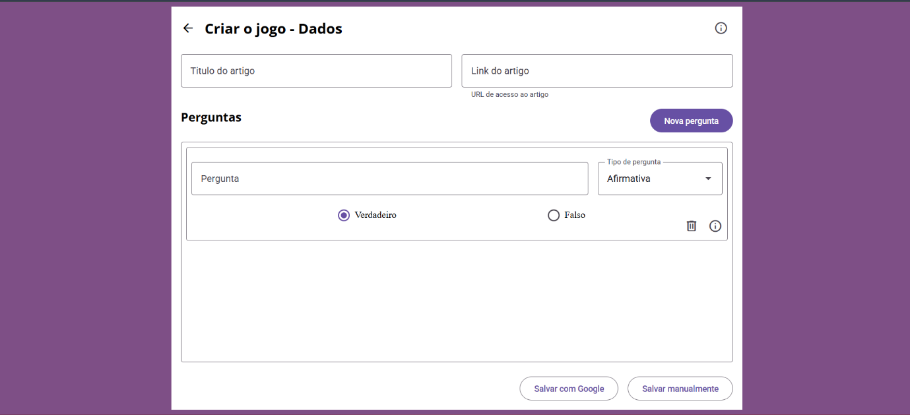

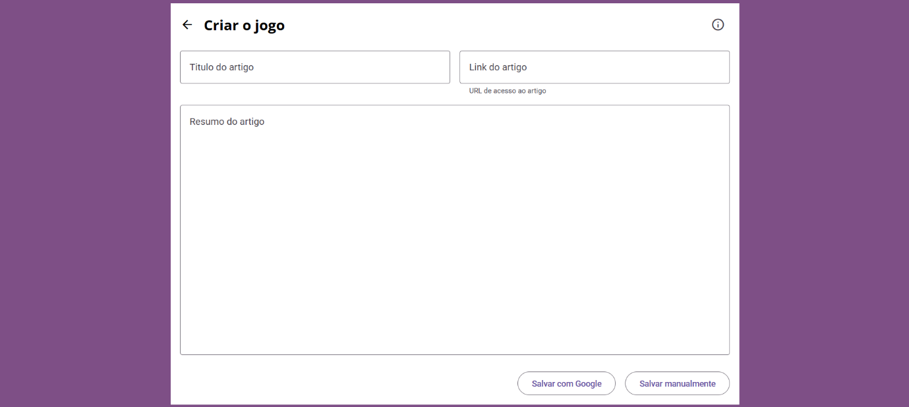

[⬆ Voltar ao Sumário](#3-principais-problemas)

---

### Problema 17

| Campo                        | Detalhes                                                                                                                                                                   |
| ---------------------------- | -------------------------------------------------------------------------------------------------------------------------------------------------------------------------- |
| **Número do Problema**       | 17                                                                                                                                                                         |
| **Avaliadores**              | **1:** [ &nbsp; ] &nbsp;&nbsp; **2:** [ X ] &nbsp;&nbsp; **3:** [ &nbsp; ] &nbsp;&nbsp; **4:** [ &nbsp; ]                                                                  |
| **Atividade**                | Avaliação da clareza do nome do jogo "Dados".                                                                                                                              |
| **Problema**                 | O nome "Dados" não representa claramente o tipo de conteúdo aceito no jogo, pois ele permite mais do que apenas dados numéricos. Isso pode gerar confusão para os usuários |
| **Heurística(s) violada(s)** | 2. Correspondência entre o sistema e o mundo real 8. Projeto estético e minimalista 10. Ajuda e documentação                                                         |
| **Severidade**               | [ ] Catastrófico &nbsp;&nbsp; [ ] Grande &nbsp;&nbsp; [X] Pequeno &nbsp;&nbsp; [X] Cosmético                                                                               |
| **Local**                    | Tela de seleção de criação de jogo                                                                                                                                         |
| **Solução**                  | Alterar o nome do jogo para algo mais descritivo, como "Informações" ou "Conteúdo", para refletir melhor a diversidade de entradas aceitas.                                |

#### Evidência(s)

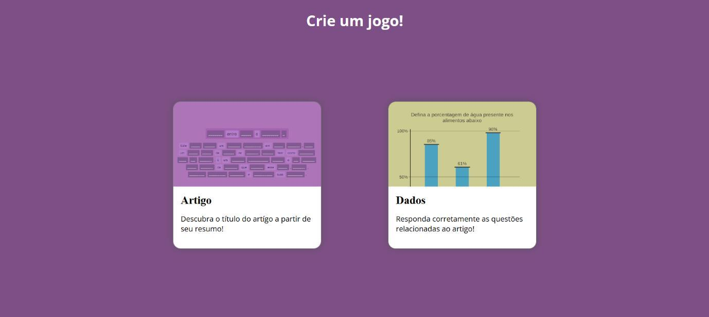

[⬆ Voltar ao Sumário](#3-principais-problemas)

---

### Problema 18

| Campo                        | Detalhes                                                                                                                                                                                                        |
| ---------------------------- | --------------------------------------------------------------------------------------------------------------------------------------------------------------------------------------------------------------- |
| **Número do Problema**       | 18                                                                                                                                                                                                              |
| **Avaliadores**              | **1:** [ &nbsp; ] &nbsp;&nbsp; **2:** [ X ] &nbsp;&nbsp; **3:** [ &nbsp; ] &nbsp;&nbsp; **4:** [ &nbsp; ]                                                                                                       |
| **Atividade**                | Avaliação do posicionamento do botão "Nova Pergunta" na criação de um jogo do tipo "Dados".                                                                                                                     |
| **Problema**                 | O botão "Nova Pergunta" não está posicionado de forma intuitiva em relação à inserção de uma nova caixa de pergunta. Isso pode dificultar a usabilidade e tornar o processo de criação do jogo menos eficiente. |
| **Heurística(s) violada(s)** | 3. Controle e liberdade do usuário 7. Flexibilidade e eficiência de uso 8. Projeto estético e minimalista                                                                                                 |
| **Severidade**               | [ ] Catastrófico &nbsp;&nbsp; [X] Grande &nbsp;&nbsp; [ ] Pequeno &nbsp;&nbsp; [ ] Cosmético                                                                                                                    |
| **Local**                    | Tela de criação do jogo "Dados"                                                                                                                                                                                 |
| **Solução**                  | Reposicionar o botão próximo ao local onde a nova pergunta será inserida embaixo das perguntas já disponíveis, garantindo um fluxo lógico na interface.                                                         |

#### Evidência(s)

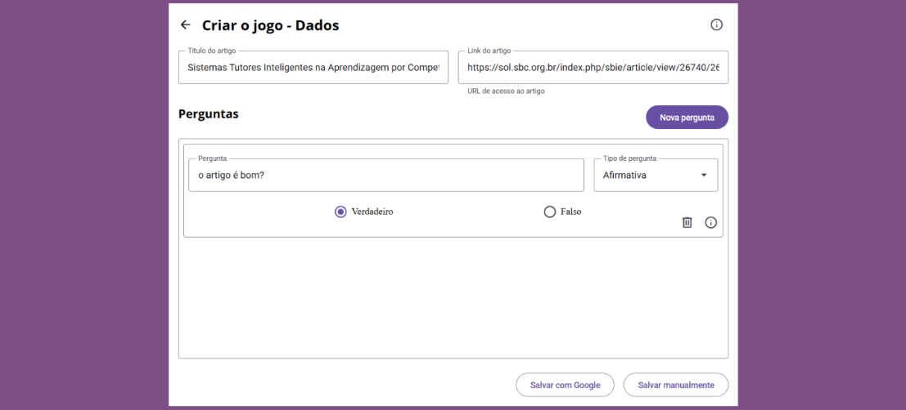

[⬆ Voltar ao Sumário](#3-principais-problemas)

---

### Problema 19

| Campo                        | Detalhes                                                                                                                                                                                                                                                                                     |
| ---------------------------- | -------------------------------------------------------------------------------------------------------------------------------------------------------------------------------------------------------------------------------------------------------------------------------------------- |
| **Número do Problema**       | 19                                                                                                                                                                                                                                                                                           |
| **Avaliadores**              | **1:** [ &nbsp; ] &nbsp;&nbsp; **2:** [ X ] &nbsp;&nbsp; **3:** [ &nbsp; ] &nbsp;&nbsp; **4:** [ &nbsp; ]                                                                                                                                                                                    |
| **Atividade**                | Avaliação da clareza dos campos "Valor Mínimo" e "Valor Máximo" na configuração da barra seletora no jogo do tipo "Dados".                                                                                                                                                                   |
| **Problema**                 | Os campos "Valor Mínimo" e "Valor Máximo" não deixam claro que se referem aos limites da barra seletora, o que pode gerar confusão para o usuário. Sem essa indicação, ele pode interpretar esses valores de forma errada, como restrições gerais da pergunta ou outro tipo de configuração. |
| **Heurística(s) violada(s)** | 1. Visibilidade do estado do sistema 2. Correspondência entre o sistema e o mundo real 10. Ajuda e documentação                                                                                                                                                                        |
| **Severidade**               | [ ] Catastrófico &nbsp;&nbsp; [ ] Grande &nbsp;&nbsp; [X] Pequeno &nbsp;&nbsp; [ ] Cosmético                                                                                                                                                                                                 |
| **Local**                    | Tela de criação de perguntas no jogo "Dados".                                                                                                                                                                                                                                                |
| **Solução**                  | Adicionar um rótulo explicativo ou um ícone de ajuda ao lado dos campos para indicar que os valores correspondem aos limites da barra seletora. Também pode ser útil incluir um exemplo visual da barra seletora com os valores definidos                                                    |

#### Evidência(s)

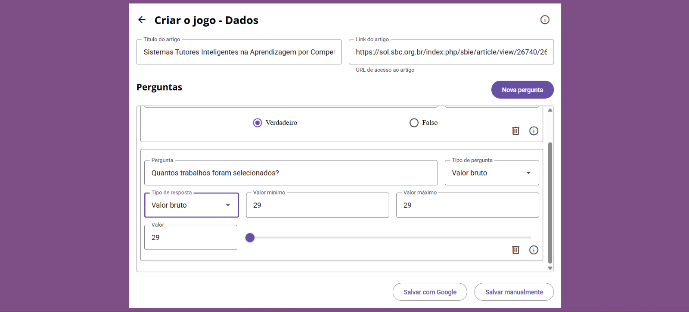

[⬆ Voltar ao Sumário](#3-principais-problemas)

---

### Problema 20

| Campo                        | Detalhes                                                                                                                                                                                                                                                                      |
| ---------------------------- | ----------------------------------------------------------------------------------------------------------------------------------------------------------------------------------------------------------------------------------------------------------------------------- |
| **Número do Problema**       | 20                                                                                                                                                                                                                                                                            |
| **Avaliadores**              | **1:** [ &nbsp; ] &nbsp;&nbsp; **2:** [ X ] &nbsp;&nbsp; **3:** [ &nbsp; ] &nbsp;&nbsp; **4:** [ &nbsp; ]                                                                                                                                                                     |
| **Atividade**                | Avaliação da clareza na utilização do tipo de pergunta "Gráfico" no jogo do tipo "Dados".                                                                                                                                                                                     |
| **Problema**                 | O tipo de pergunta "Gráfico" não possui uma explicação clara sobre como deve ser utilizado, o que pode gerar dúvidas no momento de sua criação. Os usuários podem não entender quais tipos de dados devem ser inseridos ou como configurar adequadamente o gráfico.           |
| **Heurística(s) violada(s)** | 1. Visibilidade do estado do sistema 2. Correspondência entre o sistema e o mundo real 10. Ajuda e documentação                                                                                                                                                         |
| **Severidade**               | [ ] Catastrófico &nbsp;&nbsp; [X] Grande &nbsp;&nbsp; [ ] Pequeno &nbsp;&nbsp; [ ] Cosmético                                                                                                                                                                                  |
| **Local**                    | Tela de criação de perguntas no jogo "Dados".                                                                                                                                                                                                                                 |
| **Solução**                  | Incluir uma explicação clara sobre o tipo de pergunta "Gráfico", com exemplos ilustrativos ou uma descrição detalhada de como configurar os dados para gerar um gráfico. Também pode ser útil adicionar um tooltip ou um ícone de ajuda para fornecer informações adicionais. |

#### Evidência(s)

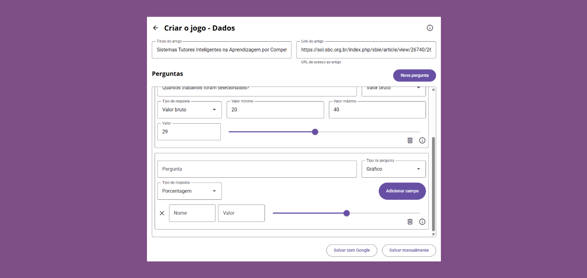

[⬆ Voltar ao Sumário](#3-principais-problemas)

---

### Problema 21

| Campo                        | Detalhes                                                                                                                                                                                                                                                                                                |
| ---------------------------- | ------------------------------------------------------------------------------------------------------------------------------------------------------------------------------------------------------------------------------------------------------------------------------------------------------- |
| **Número do Problema**       | 21                                                                                                                                                                                                                                                                                                      |
| **Avaliadores**              | **1:** [ &nbsp; ] &nbsp;&nbsp; **2:** [ X ] &nbsp;&nbsp; **3:** [ &nbsp; ] &nbsp;&nbsp; **4:** [ &nbsp; ]                                                                                                                                                                                               |
| **Atividade**                | Avaliação da inconsistência na atualização dos valores padrão de "Valor Máximo" e "Valor Mínimo" na barra seletora no jogo do tipo "Dados".                                                                                                                                                             |
| **Problema**                 | Os valores padrão de "Valor Máximo" e "Valor Mínimo" são inseridos automaticamente, mas os outros campos, como a barra seletora, não refletem esses valores corretamente. Isso pode causar confusão para o usuário, que pode não perceber a discrepância e configurar a pergunta de maneira inadequada. |
| **Heurística(s) violada(s)** | 1. Visibilidade do estado do sistema 4. Consistência e padronização 5. Prevenção de erros                                                                                                                                                                                                         |
| **Severidade**               | [ ] Catastrófico &nbsp;&nbsp; [ ] Grande &nbsp;&nbsp; [X] Pequeno &nbsp;&nbsp; [ ] Cosmético                                                                                                                                                                                                            |
| **Local**                    | Tela de criação de perguntas no jogo "Dados".                                                                                                                                                                                                                                                           |
| **Solução**                  | Garantir que todos os elementos da interface, incluindo a barra seletora, sejam atualizados automaticamente quando os valores padrão forem inseridos. Caso a sincronização não seja possível, incluir um aviso para o usuário informando que a barra seletora precisa ser ajustada manualmente.         |

#### Evidência(s)

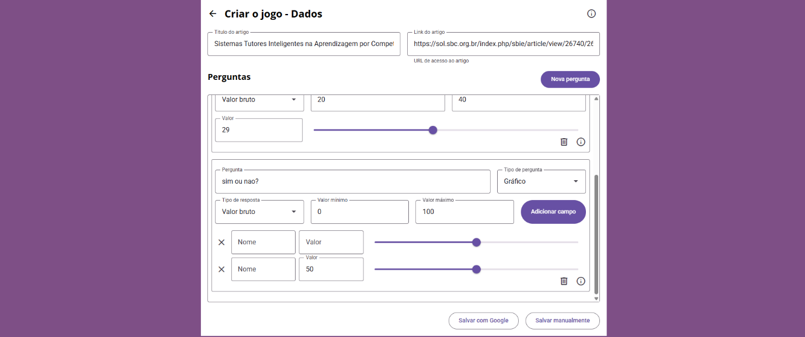

[⬆ Voltar ao Sumário](#3-principais-problemas)

---

### Problema 22

| Campo                        | Detalhes                                                                                                                                                                                                                                                                                                                                                |
| ---------------------------- | ------------------------------------------------------------------------------------------------------------------------------------------------------------------------------------------------------------------------------------------------------------------------------------------------------------------------------------------------------- |
| **Número do Problema**       | 22                                                                                                                                                                                                                                                                                                                                                      |
| **Avaliadores**              | **1:** [ &nbsp; ] &nbsp;&nbsp; **2:** [ X ] &nbsp;&nbsp; **3:** [ &nbsp; ] &nbsp;&nbsp; **4:** [ &nbsp; ]                                                                                                                                                                                                                                               |
| **Atividade**                | Avaliação da falta de feedback ao usuário ao inserir valores acima do limite no tipo de pergunta "Gráfico" no jogo do tipo "Dados".                                                                                                                                                                                                                     |
| **Problema**                 | Quando o usuário insere valores maiores que o valor máximo permitido, o sistema os ajusta automaticamente para o valor máximo definido, mas não fornece nenhum feedback ao usuário. Isso pode gerar confusão, pois o usuário pode não perceber que seus valores foram modificados, levando a interpretações errôneas dos dados apresentados no gráfico. |
| **Heurística(s) violada(s)** | 1. Visibilidade do estado do sistema 4. Consistência e padronização 5. Prevenção de erros                                                                                                                                                                                                                                                         |
| **Severidade**               | [ ] Catastrófico &nbsp;&nbsp; [ ] Grande &nbsp;&nbsp; [X] Pequeno &nbsp;&nbsp; [ ] Cosmético                                                                                                                                                                                                                                                            |
| **Local**                    | Tela de criação de perguntas no jogo "Dados".                                                                                                                                                                                                                                                                                                           |
| **Solução**                  | Exibir uma mensagem de aviso informando que os valores foram ajustados automaticamente para o valor máximo permitido. Uma alternativa é destacar visualmente os valores modificados para que o usuário perceba a alteração antes de confirmar a pergunta.                                                                                               |

#### Evidência(s)

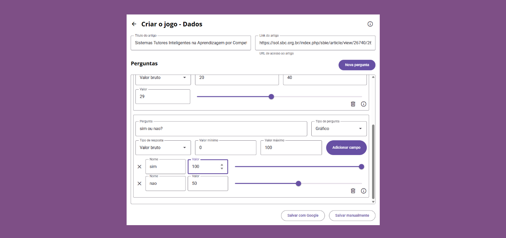

[⬆ Voltar ao Sumário](#3-principais-problemas)

---

### Problema 23

| Campo                        | Detalhes                                                                                                                                                                                                                                                                                                     |
| ---------------------------- | ------------------------------------------------------------------------------------------------------------------------------------------------------------------------------------------------------------------------------------------------------------------------------------------------------------ |
| **Número do Problema**       | 23                                                                                                                                                                                                                                                                                                           |
| **Avaliadores**              | **1:** [ &nbsp; ] &nbsp;&nbsp; **2:** [ X ] &nbsp;&nbsp; **3:** [ &nbsp; ] &nbsp;&nbsp; **4:** [ &nbsp; ]                                                                                                                                                                                                    |
| **Atividade**                | Avaliação do rótulo do botão no pop-up de resposta após acertar uma pergunta no jogo "Dados".                                                                                                                                                                                                                |
| **Problema**                 | O pop-up exibido após o usuário acertar uma pergunta contém um botão rotulado como "Confirmar", o que não condiz com a ação esperada. Esse rótulo pode causar confusão, pois "Confirmar" sugere que o usuário precisa validar algo, enquanto o esperado seria apenas prosseguir para a próxima etapa do jogo |
| **Heurística(s) violada(s)** | 1. Visibilidade do estado do sistema 2. Correspondência entre o sistema e o mundo real 10. Ajuda e documentação                                                                                                                                                                                        |
| **Severidade**               | [ ] Catastrófico &nbsp;&nbsp; [ ] Grande &nbsp;&nbsp; [X] Pequeno &nbsp;&nbsp; [X] Cosmético                                                                                                                                                                                                                 |
| **Local**                    | Pop-up de resposta no jogo "Dados".                                                                                                                                                                                                                                                                          |
| **Solução**                  | Alterar o rótulo do botão para algo mais adequado ao contexto, como "Continuar", "Próxima Pergunta" ou "Avançar", tornando a interface mais intuitiva e alinhada à ação realizada pelo usuário.                                                                                                              |

#### Evidência(s)

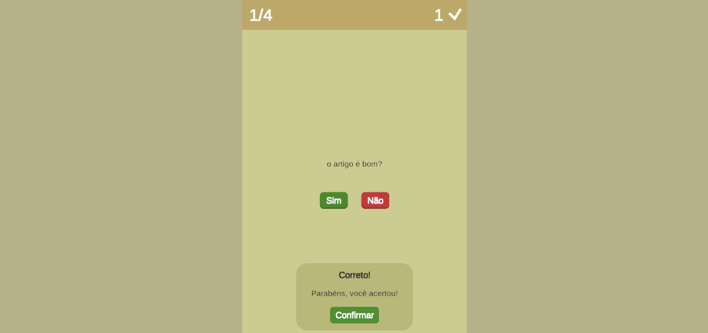

[⬆ Voltar ao Sumário](#3-principais-problemas)

---

### Problema 24

| Campo                        | Detalhes                                                                                                                                                                                                                                                                                                      |
| ---------------------------- | ------------------------------------------------------------------------------------------------------------------------------------------------------------------------------------------------------------------------------------------------------------------------------------------------------------- |
| **Número do Problema**       | 24                                                                                                                                                                                                                                                                                                            |
| **Avaliadores**              | **1:** [ &nbsp; ] &nbsp;&nbsp; **2:** [ X ] &nbsp;&nbsp; **3:** [ &nbsp; ] &nbsp;&nbsp; **4:** [ &nbsp; ]                                                                                                                                                                                                     |
| **Atividade**                | Avaliação da cor e rótulo do botão no pop-up de resposta ao errar uma pergunta no jogo "Dados"                                                                                                                                                                                                                |
| **Problema**                 | Quando o usuário erra uma pergunta, o pop-up de resposta exibe um botão verde com o rótulo "Confirmar". Isso pode causar confusão, pois a cor verde geralmente está associada à sucesso, enquanto a resposta foi incorreta. Esse conflito visual pode levar o usuário a interpretar erroneamente o resultado. |
| **Heurística(s) violada(s)** | 1. Visibilidade do estado do sistema 2. Correspondência entre o sistema e o mundo real 4. Consistência e padronização 5. Prevenção de erros                                                                                                                                                          |
| **Severidade**               | [ ] Catastrófico &nbsp;&nbsp; [ ] Grande &nbsp;&nbsp; [X] Pequeno &nbsp;&nbsp; [ ] Cosmético                                                                                                                                                                                                                  |
| **Local**                    | Pop-up de resposta no jogo "Dados".                                                                                                                                                                                                                                                                           |
| **Solução**                  | Alterar a cor do botão para uma que indique erro ou neutralidade, como vermelho ou cinza, e modificar o rótulo para algo mais apropriado, como "Tentar Novamente" ou "Continuar". Isso garantirá que o feedback visual esteja alinhado com o resultado da resposta.                                           |

#### Evidência(s)

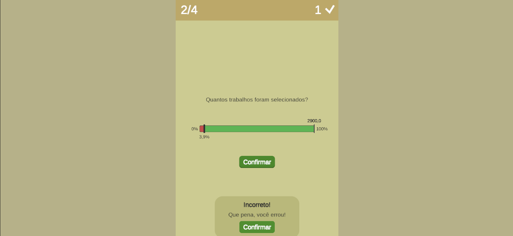

[⬆ Voltar ao Sumário](#3-principais-problemas)

---

### Problema 25

| Campo                        | Detalhes                                                                                                                                                                                                                                                                                                                                                                                                                                                                                                                                         |
| ---------------------------- | ------------------------------------------------------------------------------------------------------------------------------------------------------------------------------------------------------------------------------------------------------------------------------------------------------------------------------------------------------------------------------------------------------------------------------------------------------------------------------------------------------------------------------------------------ |
| **Número do Problema**       | 25                                                                                                                                                                                                                                                                                                                                                                                                                                                                                                                                               |
| **Avaliadores**              | **1:** [ &nbsp; ] &nbsp;&nbsp; **2:** [ X ] &nbsp;&nbsp; **3:** [ &nbsp; ] &nbsp;&nbsp; **4:** [ &nbsp; ]                                                                                                                                                                                                                                                                                                                                                                                                                                        |
| **Atividade**                | Avaliação da exibição de informações sobre o desempenho no final do teste no jogo "Dados"                                                                                                                                                                                                                                                                                                                                                                                                                                                        |
| **Problema**                 | Ao final do teste, o sistema exibe apenas a porcentagem de acertos, sem apresentar o número total de questões respondidas ou a quantidade de erros cometidos. A apresentação isolada da porcentagem compromete a clareza da avaliação, já que o usuário não tem acesso ao contexto completo do seu desempenho. Isso dificulta o entendimento de quão bem ou mal foi sua performance, especialmente em testes curtos, onde a porcentagem pode ser enganosa.                                                                                       |
| **Heurística(s) violada(s)** | 1. Visibilidade do estado do sistema 2. Correspondência entre o sistema e o mundo real 3. Controle e liberdade do usuário                                                                                                                                                                                                                                                                                                                                                                                                                  |
| **Severidade**               | [X] Catastrófico &nbsp;&nbsp; [ ] Grande &nbsp;&nbsp; [ ] Pequeno &nbsp;&nbsp; [ ] Cosmético                                                                                                                                                                                                                                                                                                                                                                                                                                                     |
| **Local**                    | Tela de resultados do teste no jogo "Dados".                                                                                                                                                                                                                                                                                                                                                                                                                                                                                                     |
| **Solução**                  | • Exibir informações adicionais junto à porcentagem de acertos, como: &nbsp;&nbsp;o Número total de perguntas respondidas &nbsp;&nbsp;o Quantidade de acertos &nbsp;&nbsp;o Quantidade de erros • Considerar também a exibição de um feedback textual ou visual (ex: emojis, medalhas ou mensagens curtas) para tornar a interpretação dos resultados mais acessível e motivadora. • Garantir que os dados sejam apresentados de forma clara, padronizada e visualmente organizada, facilitando a leitura rápida e a compreensão. |

#### Evidência(s)

[⬆ Voltar ao Sumário](#3-principais-problemas)

---

### Problema 26

| Campo                        | Detalhes                                                                                                                                                                                                                                                               |
| ---------------------------- | ---------------------------------------------------------------------------------------------------------------------------------------------------------------------------------------------------------------------------------------------------------------------- |
| **Número do Problema**       | 26                                                                                                                                                                                                                                                                     |
| **Avaliadores**              | **1:** [ &nbsp; ] &nbsp;&nbsp; **2:** [ X ] &nbsp;&nbsp; **3:** [ &nbsp; ] &nbsp;&nbsp; **4:** [ &nbsp; ]                                                                                                                                                              |
| **Atividade**                | Avaliação da terminologia utilizada para descrever as perguntas no jogo "Dados"                                                                                                                                                                                        |
| **Problema**                 | O termo "problemas" não condiz com a dinâmica do jogo, pois o usuário está respondendo a questões. O uso dessa terminologia pode causar estranhamento ou confusão, já que termos como "teste" ou "jogo" seriam mais apropriados para representar a atividade realizada |
| **Heurística(s) violada(s)** | 2. Correspondência entre o sistema e o mundo real                                                                                                                                                                                                                      |
| **Severidade**               | [ ] Catastrófico &nbsp;&nbsp; [ ] Grande &nbsp;&nbsp; [ ] Pequeno &nbsp;&nbsp; [X] Cosmético                                                                                                                                                                           |
| **Local**                    | Tela de resultados do teste no jogo "Dados".                                                                                                                                                                                                                           |
| **Solução**                  | Substituir o termo "problemas" por "teste", "questões" ou "jogo", garantindo que a terminologia utilizada esteja alinhada com a experiência do usuário e o propósito do sistema.                                                                                       |

#### Evidência(s)

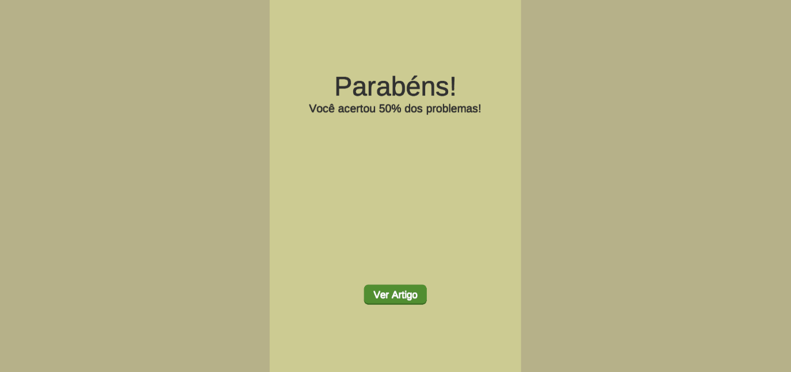

[⬆ Voltar ao Sumário](#3-principais-problemas)

---

### Problema 27

| Campo                        | Detalhes                                                                                                                                                                                                                                                                                    |
| ---------------------------- | ------------------------------------------------------------------------------------------------------------------------------------------------------------------------------------------------------------------------------------------------------------------------------------------- |
| **Número do Problema**       | 27                                                                                                                                                                                                                                                                                          |
| **Avaliadores**              | **1:** [ &nbsp; ] &nbsp;&nbsp; **2:** [ X ] &nbsp;&nbsp; **3:** [ &nbsp; ] &nbsp;&nbsp; **4:** [ &nbsp; ]                                                                                                                                                                                   |
| **Atividade**                | Avaliação da exibição de valores ao errar uma pergunta do tipo "Valor Bruto" no jogo "Dados".                                                                                                                                                                                               |
| **Problema**                 | Quando o usuário erra uma pergunta do tipo "Valor Bruto", um valor (por exemplo, 2900,0) é exibido acima da barra seletora sem qualquer explicação. Isso pode gerar confusão, pois o usuário não sabe se esse número representa a resposta correta, uma sugestão ou outro tipo de feedback. |
| **Heurística(s) violada(s)** | 1. Visibilidade do estado do sistema 2. Correspondência entre o sistema e o mundo real 5. Prevenção de erros                                                                                                                                                                          |
| **Severidade**               | [ ] Catastrófico &nbsp;&nbsp; [ ] Grande &nbsp;&nbsp; [X] Pequeno &nbsp;&nbsp; [ ] Cosmético                                                                                                                                                                                                |
| **Local**                    | Tela de resposta ao errar uma pergunta do tipo "Valor Bruto" no jogo "Dados".                                                                                                                                                                                                               |
| **Solução**                  | Incluir um rótulo ou explicação indicando o significado do valor exibido. Por exemplo, "A resposta correta era: 2900,0" ou "Limite máximo permitido: 2900,0". Isso ajudaria o usuário a interpretar corretamente a informação apresentada.                                                  |

#### Evidência(s)

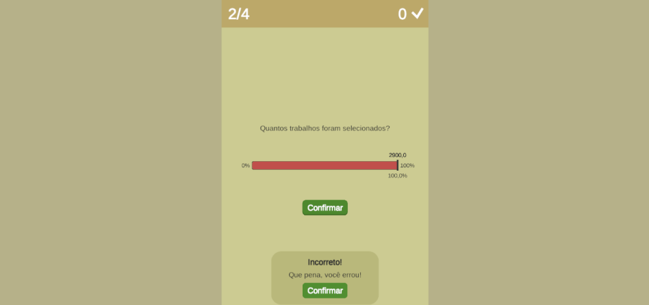

[⬆ Voltar ao Sumário](#3-principais-problemas)

---

### Problema 28

| Campo                        | Detalhes                                                                                                                                                                                                                                                                   |
| ---------------------------- | -------------------------------------------------------------------------------------------------------------------------------------------------------------------------------------------------------------------------------------------------------------------------- |
| **Número do Problema**       | 28                                                                                                                                                                                                                                                                         |
| **Avaliadores**              | **1:** [ &nbsp; ] &nbsp;&nbsp; **2:** [ X ] &nbsp;&nbsp; **3:** [ &nbsp; ] &nbsp;&nbsp; **4:** [ &nbsp; ]                                                                                                                                                                  |
| **Atividade**                | Avaliação da indicação do tipo "Valor Bruto" e inconsistência da barra seletora no jogo "Dados".                                                                                                                                                                           |
| **Problema**                 | A pergunta do tipo "Valor Bruto" é indicada como porcentagem, o que pode causar confusão ao usuário. Além disso, a barra seletora utilizada para inserir valores não condiz com os valores indicados no formulário de criação do jogo, tornando a interação inconsistente. |
| **Heurística(s) violada(s)** | 2. Correspondência entre o sistema e o mundo real 4. Consistência e padronização 6. Reconhecimento em vez de memorização                                                                                                                                             |
| **Severidade**               | [ ] Catastrófico &nbsp;&nbsp; [X] Grande &nbsp;&nbsp; [ ] Pequeno &nbsp;&nbsp; [ ] Cosmético                                                                                                                                                                               |
| **Local**                    | Tela de criação de perguntas no jogo "Dados"                                                                                                                                                                                                                               |
| **Solução**                  | Ajustar a nomenclatura da pergunta para evitar a associação incorreta com porcentagem. Além disso, corrigir a barra seletora para que aceite valores coerentes com os indicados no formulário, garantindo consistência e previsibilidade na interação                      |

#### Evidência(s)

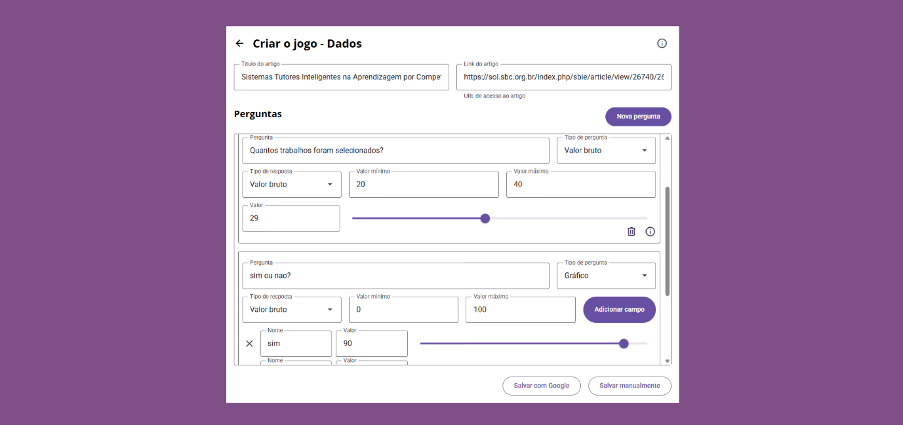

[⬆ Voltar ao Sumário](#3-principais-problemas)

---

## 4. Resumo dos Resultados

### a. Problemas Identificados por Heurística

A avaliação heurística apontou violações em praticamente todas as dez heurísticas de Nielsen, com destaque para algumas ocorrências mais frequentes[cite: 1].

A heurística 1, que trata da visibilidade do estado do sistema, foi violada em situações como a ausência de feedback ao inserir palavras já descobertas e a apresentação de mensagens de desempenho pouco informativas, como demonstrado nos problemas 9, 14 e 25[cite: 1]. Também se observou a recorrente violação da heurística 2, referente à correspondência entre o sistema e o mundo real, evidenciada pelo uso de terminologias pouco familiares ao usuário e por uma navegação que não segue padrões intuitivos, como nos problemas 2, 17 e 26[cite: 1].

### b. Problemas Classificados por Severidade

Com base na gravidade dos problemas, foi possível classificá-los em três categorias distintas[cite: 1]:

- **Problemas catastróficos:** Que afetam diretamente a usabilidade e exigem correções urgentes, incluem a ausência de feedback claro ao final dos jogos (problemas 14 e 25), a impossibilidade de rolar o texto em determinadas áreas (problema 5) e a validação excessivamente rígida de palavras (problema 6), que pode bloquear a progressão do usuário injustamente[cite: 1].
- **Problemas graves (grandes):** Comprometem a fluidez da experiência, embora não impeçam a utilização do sistema[cite: 1]. Entre eles, destacam-se botões mal posicionados (problema 18), bem como inconsistências visuais e terminológicas (problemas 12, 23 e 26), que dificultam a compreensão e aumentam a carga cognitiva[cite: 1].
- **Problemas leves ou cosméticos:** Dizem respeito a aspectos visuais ou de consistência que não afetam diretamente o funcionamento, mas cuja correção pode contribuir para uma experiência mais agradável[cite: 1]. É o caso de detalhes como o espaçamento inadequado entre caixas de texto (problema 8) e a escolha pouco clara do rótulo "Confirmar" em determinados botões (problema 23)[cite: 1].

### c. Problemas Prioritários a Serem Resolvidos

Entre os principais pontos que demandam atenção imediata, destaca-se a necessidade de aprimorar a visibilidade e o feedback do sistema durante interações cruciais, como a inserção de respostas e o encerramento das atividades[cite: 1]. Além disso, é fundamental corrigir inconsistências na interface, tanto em termos visuais quanto terminológicos, garantindo uma linguagem clara e padronizada[cite: 1].

A implementação de validações mais inteligentes e mensagens de orientação também se mostra urgente, a fim de prevenir erros e facilitar a recuperação quando eles ocorrerem[cite: 1]. Outro aspecto importante diz respeito à tolerância do sistema frente às variações de entrada por parte do usuário, como o uso de letras maiúsculas ou minúsculas e a presença ou ausência de acentuação, algo que acontece no jogo "Artigo" — ajustes simples que podem reduzir consideravelmente a frustração do público-alvo[cite: 1].

---

## 5. Conclusão

De modo geral, a avaliação heurística revelou que o editor de jogos possui uma proposta promissora e funcionalidades interessantes, especialmente no que diz respeito à diversidade de jogos e às opções de personalização disponíveis[cite: 1]. No entanto, as falhas de usabilidade identificadas comprometem significativamente a clareza da interface e a qualidade da experiência do usuário[cite: 1].

Os principais pontos fracos concentram-se na ausência de feedback informativo, em inconsistências na comunicação do sistema e na escassez de documentação para funcionalidades essenciais, o que pode dificultar especialmente o uso por parte de usuários menos experientes[cite: 1]. Apesar dessas limitações, o sistema se mostrou bem estruturado e com potencial de crescimento[cite: 1]. Com a implementação das melhorias sugeridas, é possível alcançar um patamar mais elevado de usabilidade, tornando o sistema mais acessível, eficiente e satisfatório para diferentes perfis de usuários[cite: 1].
